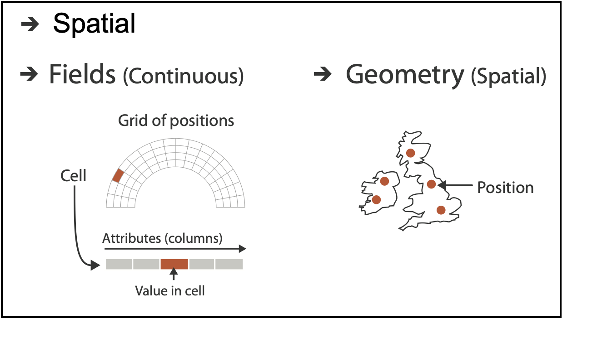
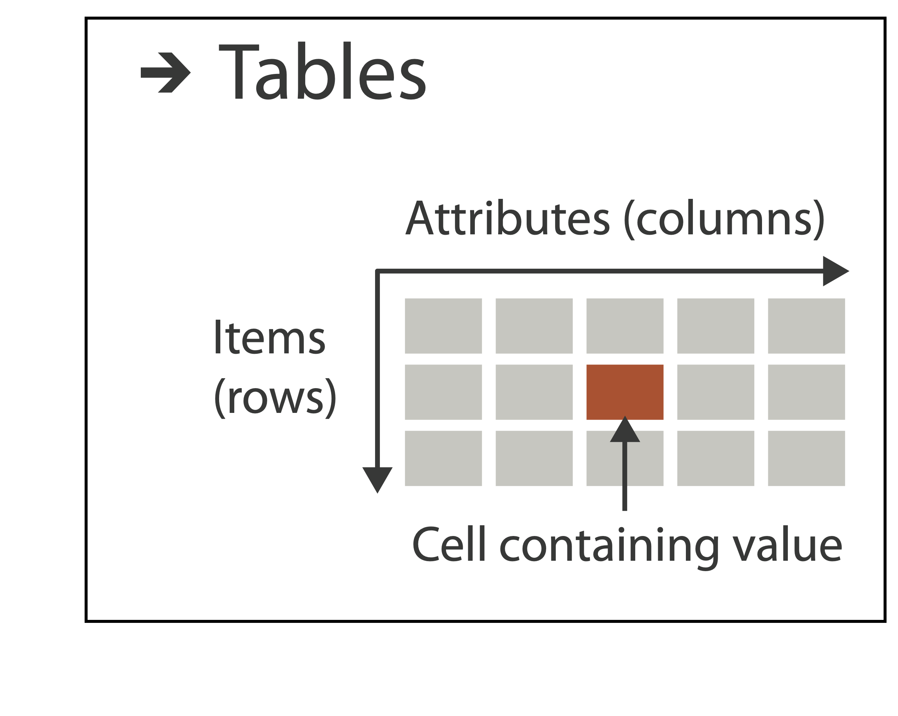

notes:
So, usually you're probably used to thinking about data like this - numerical or quantitative which is then broken down into discrete & continous.

Also categorical or qualitative data which is either ordered (ordinal) or unordered (nominal).

---

We need to dig a little deeper for visualizing data.

notes:
This is a fine for something like stats, but we have to start thinking about how data type and format maps itself visually -- what is the best mapping for our visual cortex?

---

### Data organization is important

	

    
	 - Munzner - https://www.cs.ubc.ca/~tmm/talks.html

notes:
We have to think a little bit about how our data represents reality *and* how it is represented on disk.

for example, both spatial data like that on a map and data that we use to compare salaries for example, are numerical data - we have lat/long and data value combinations for geographic data and numbers for salaries, but there is something fundementally different about how we would represent these two datasets on a visualization

Similarly for categorical data like with an organization, network, or a tree -- this data is much different than a table of categorical occurances.

---

### Example: Temporal data is numerical, but its also something "else"

<!-- .slide: class="two-floating-elements" -->

notes:
temporal data, like here the temperature change in a vew places over time, is numerical, but, depending on what time spans we are interested in, its can also be periodic

The first graph tell us a lot, and the 2nd may at first be a little weird to read but it tells us information about both changes in time and the averages about the place *and* it captures a central nature about this data - that it is periodic

---
