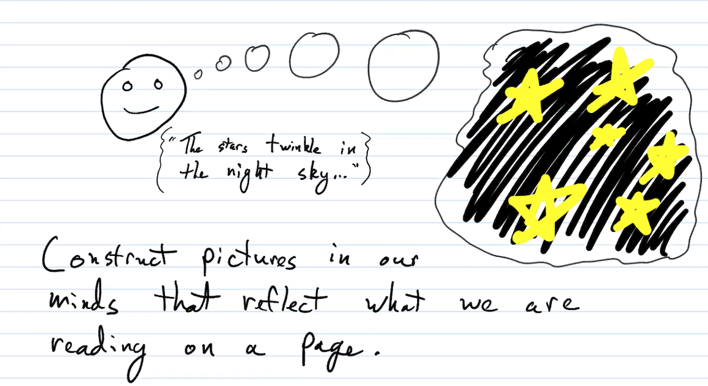
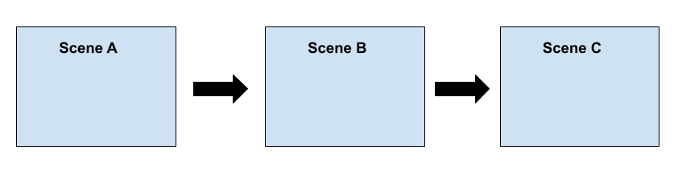
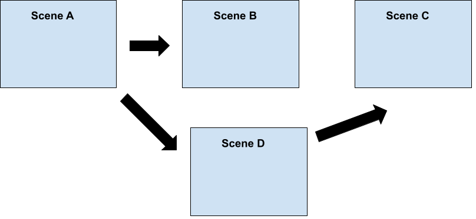
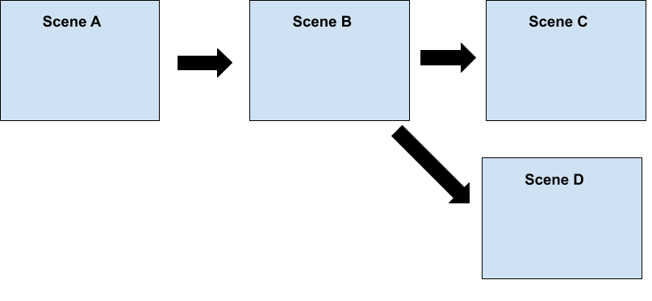
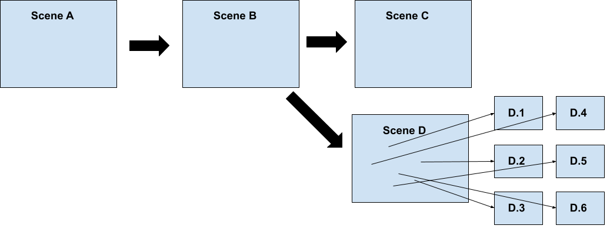
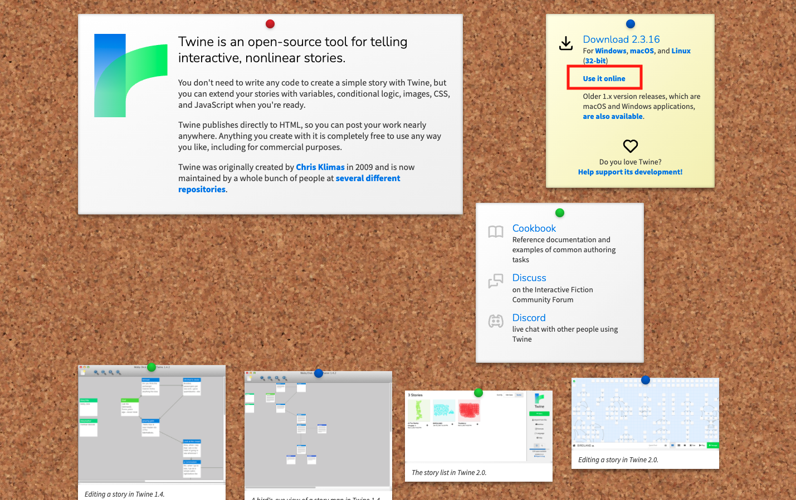
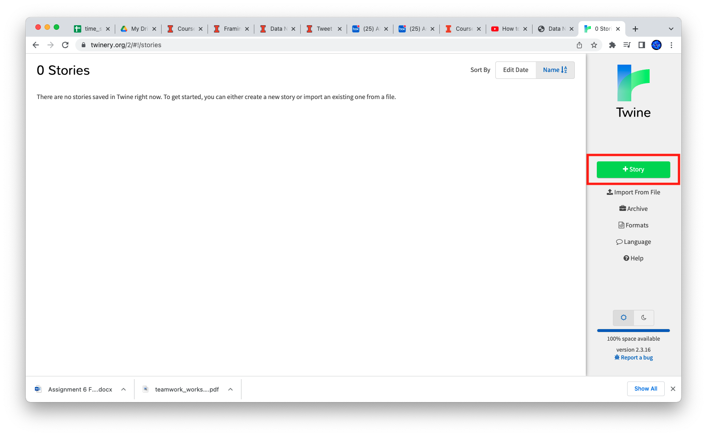

## Storytelling Form: interactive vs static

 * Narrative
 * Navigable
 * Hybrid
 
notes:
recall we discussed this 2 weeks before spring break at the very end of class

We had a discussion about framing devices -- i.e. how we "set the stage" for our listener/viewer to engage with our data story

---

## Framing Devices Refresher

Our "frame" can often dictate how much control our user has (from Narrative/Static to Hybrid to fully Navigable/Interactive).

notes:
the very last thing we discussed was how our choice of "frame" can often dictate how much control our listener/reader/user has over their consumption of our story

---

## Framing Devices Refresher

Our "frame" can often dictate how much control our user has (from Narrative/Static to Hybrid to fully Navigable/Interactive).

 * [Bear Attack Survival Quiz](https://www.nytimes.com/interactive/2021/well/live/bear-attack-tips.html)
 * [Figures in the Sky](http://www.datasketch.es/may/code/nadieh/) (and [write-up](https://www.visualcinnamon.com/portfolio/figures-in-the-stars))
 
 
Other cool sites we won't get to:
 * [Selfie City](http://selfiecity.net/)
 * [Letter Frequency](https://public.tableau.com/en-us/gallery/frequency-letters)
 * [Legend of Nixon, Sonically](https://twotone.io/examples/legend-of-nixon/) (also check out  https://twotone.io/)

notes:
real quick, here are some cool examples from a more narrative representation (Bear Attack) vs. Figures in the Sky

---

## Storytelling Form: interactive vs static

 * Narrative (Static)
 * Navigable (Fully Interactive)
 * Hybrid (Partially Interactive)

notes:

So, sometimes the amount of navigatability is chosen by our frame, but generally this is something we want to think carefully about and make specific choices when we can.

I.e. we want to be very careful in deciding how much control do we want to give our audience in the exploration of the story?

 * narrative (static): you go tell someone, or canned conversations in a game
 * navigable (fully interactive): user is in control, more invested in some cases
 * hybrid (partially interactive): spectrum! this is often what we will do -- for example with google data studio the user can have some control over the look of a graph, or the range of data in it, but they don't have control over what graphs are present in your report -- you do!

---

## Narrative Control

  
<u><b>Broadcast:</b></u> ordering and flow are generally predetermined, control of narrative is disconnected from listener/viewer.

notes:
in a bit more detail, when you are presenting a data story you can think about which sort of situation you are telling your story in

often times when we are presenting a talk, this can be thought of as a "broadcasting" form of narrative control

---

## Narrative Control

  
<u><b>Broadcast:</b></u> ordering and flow are generally predetermined, control of narrative is disconnected from listener/viewer.

  
<u><b>Interactive:</b></u> iterative and/or discussion-based. Flow and ordering of story is flexible and can sometimes not be repeatable (depending on medium).

notes:
on the other end of the spectrum, you have something like a conversation that is interactive

"interactive" can mean a bunch of different things -- a conversation about a data topic could be thought of as an interactive data story, but also something like the "choose your own" adventure books we discussed previously are a single-person interactive story (though, not generally about data)

in reality, you will likely have a mix of two things -- you can have some interactivity in your talks by asking your audience questions or taking a poll; or if you have an interactive story you've built online you can provide your user some structure to move through the story in a way that enables a larger degree of understanding

---

   

# How does this relate to data storytelling and visualization?

notes:
so I think a fair question at this point would be how does this relate to data storytelling and visualization?

and how can we think about this distinction in practice?

---

## Narrative Control with Data Visualization

We need to think carefully about how viewers/listeners interact with our information and visualizations.

notes:
so, I can tell you that "we need..."

but why? well visualizations are powerful and in what they can communicate and how they can help folks comprehend what is going on

---

## Visualization as a reading strategy

- Prof. Matt Turk's fantastic drawing

notes:
so here I'm blatantly stealing an image from Prof. Matt Turk, one of the originators of this course, in which he talks about the fact that visualization is useful to us from a very young age as we use it as a reading strategy

so often when we are learning to read as kids, we use what we read to create a visual representation in our heads about the text

for example, if I read "the stars twinkle in the night sky" we might picture looking up to see stars at night, or might make a drawing of "star shaped things" in our head with a black background

---

## Visualization as a data comprehension strategy

 
 
notes:
visualization is also useful for data comprehension and different visualization and the order we decide to present them to our audience matters

for example, what if show you this example of an HR diagram, or the Hertsprung Russel diagram that is pretty famous in astronomy showing the relationships between brightness and temperature of different kinds of stars vs...

---

## Visualization as a data comprehension strategy

notes:
... this representation 

this representation is more sparse and actually labels objects the general population might have heard of before

for example, our sun is listed as are other stars folks may have heard of like Sirius and Betelgeuse (betelgeuse is the redish looking star in the constallation orion's shoulder)

---

## Visualization as a data comprehension strategy

<table style="border-collapse: collapse; border: none;">
<tr style="border: none;">
<td style="border: none; vertical-align:top">
    

</td>
<td style="border: none; vertical-align:top" >
        

</td>
<td style="border: none; vertical-align:top">

</td>
</tr>
</table>

notes:
the order I showed you matters here! I showed the more technical plot first, so you probably didn't get a lot out of it...

---

## Visualization as a data comprehension strategy

<table style="border-collapse: collapse; border: none;">
<tr style="border: none;">
<td style="border: none; vertical-align:top">

</td>
<td style="border: none; vertical-align:top" >
        

</td>
<td style="border: none; vertical-align:top">
    

</td>
</tr>
</table>

notes:
... had I shown you them in the other order, you might have been able to start drawing some similarites between the two plots -- the new concepts of "Spectral Class" and "Absolute Magnitude" added to this plot could have been given the context of the previous plot

---

## Visualization as a data comprehension strategy

<table style="border-collapse: collapse; border: none;">
<tr style="border: none;">
<td style="border: none; vertical-align:top">
       
Information about different kinds of stars
</td>
<td style="border: none; vertical-align:top" >
      

</td>
<td style="border: none; vertical-align:top">
   

</td>
<td style="border: none; vertical-align:top" >
      

</td>
<td style="border: none; vertical-align:top">
    

</td>
</tr>
</table>

Visualizations (and the context surrounding them) aids in our comprehension of data.

notes:
in reality, I probably should have given you some more contextual information about stars before showing you anything, but this was just a toy example

the main take-away here is that the different visualizations presented in different ways can either help or hinder our understanding of a data concept

---

## Visualization as a data comprehension strategy

<table style="border-collapse: collapse; border: none;">
<tr style="border: none;">
<td style="border: none; vertical-align:top">
       
Information about different kinds of stars
</td>
<td style="border: none; vertical-align:top" >
      

</td>
<td style="border: none; vertical-align:top">
   

</td>
<td style="border: none; vertical-align:top" >
      

</td>
<td style="border: none; vertical-align:top">
    

</td>
</tr>
</table>

Visualizations (and the context surrounding them) aids in our comprehension of data.
  
More interactivity generally gives the listener/user more agency over forming comprehension from visualizations.

notes:
also, I could have added even more interactivity to explore these visualization -- what if I had given over narrative control so you could have explored each of these figures and parts of these figures yourselves?

this would have given more agency to you to form these mappings between the data and your conceptual map on your own

---

## Organizational Strategies for Data Storytelling

* Linearity
* Interactivity
* Causality
* Details/Zoomability/Perspective

 
notes:
as we start thinking about how we want to develop our datastory along these "axis" of interactive and broadcast we can use several organizational strategies to do so

these are not in opposition to each other and you are free to mix and match

also see that linearity and causality are related as are Perspective/Interactivity

---

## Organizational Strategies for Data Storytelling

* Linearity: Is there a defined order in which the data needs to be explored?
* Interactivity: How much control should the "reader" have over the display and flow of the story?
* Causality: Are there necessary dependancies between elements (or "beats") of the story? Are there points that are necessarily related?
* Details/Zoomability/Perspective: Can further information be provided about specific topics or data points?

 
notes:
here are some questions you can ask yourself while constructing your narrative control structures **read**

---

## What is a Scene?

<b>Scene (movie/play):</b> 
* one of the subdivisions of a play: such as
 * a: a division of an act presenting continuous action in one place
 * b: a single situation or unit of dialogue in a play
 * c: a motion-picture or television episode or sequence
* a stage setting
 * a real or imaginary prospect suggesting a stage setting
* the place of an occurrence or action

[Quoted from: Merriam-Webster](https://www.merriam-webster.com/dictionary/scene)

notes:
to discuss a few of these more, we need to define what we mean by a "scene" here?

Well, its probably easier to see some examples, but let's start with a more formal definition.

For movies or a play... **read**

---

## What is a Scene?

<b>Scene (movie/play):</b> 
* one of the subdivisions of a play: such as
 * a: a division of an act presenting continuous action in one place
 * b: a single situation or unit of dialogue in a play
 * c: a motion-picture or television episode or sequence
* a stage setting
 * a real or imaginary prospect suggesting a stage setting
* the place of an occurrence or action

[Quoted from: Merriam-Webster](https://www.merriam-webster.com/dictionary/scene)

<b>Scene (game design):</b> assets that contain all or part of a game or application. For example, you might build a simple game in a single scene, while for a more complex game, you might use one scene per level, each with its own environments, characters, obstacles, decorations, and UI (user interface).

[Quoted from: Unity Game Engine](https://docs.unity3d.com/Manual/CreatingScenes.html)

notes:
in something like desiging a game, its a little different... **read**

game design is probably closer to what we mean by "scene" in terms of a data story -- including data characters, data settings, etc

but really, its sort of a mesh of the two together

for us, let's think about scenes in the context of someone investigating an online data journalism story

---

## Linearity

<b><u>A</u></b> leads to <b><u>B</u></b> which leads to <b><u>C</u></b> for *temporal* reasons.

notes:
here we have an example of *temporal* linearity, i.e. this is the ORDER in which we want to introduce concepts

this is different from causal where A *causes* B *causes* C

---

## Linearity

<b><u>A</u></b> leads to <b><u>B</u></b> which leads to <b><u>C</u></b> for *temporal* reasons.

<table style="border-collapse: collapse; border: none;">
<tr style="border: none;">
<td style="border: none; vertical-align:top">
       
Information about different kinds of stars
</td>
<td style="border: none; vertical-align:top" >
      

</td>
<td style="border: none; vertical-align:top">
   

</td>
<td style="border: none; vertical-align:top" >
      

</td>
<td style="border: none; vertical-align:top">
    

</td>
</tr>
</table>

notes:

this is like the HR diagram example -- the data to enable to me to tell you anything about stars is actually the "end" of the things I would show you -- we had to get all the data about stars before we knew anything about them!

but if I started off explaining all the data points here in the far right image, you'd probably get lost 

---

## Interactivity

Interactivity from a *storytelling* perspective.

notes:
this is a bit different from how we've been using interactivity before -- we have used google data studio to make interactive *data visualizations*

but this is a bit different -- this is interactive based on the *storytelling perspective*

---

## Interactivity

Interactivity from a *storytelling* perspective.

notes:
this is more akin to what we talked about last week with the "choose your own" adventure books and/or bandersnatch

this is what we'll be practicing with Twine for the next few weeks in class

---

## Causality

<b><u>B</u></b> is *caused* by <b><u>A</u></b>.  <b><u>C</u></b> and <b><u>D</u></b> are caused by <b><u>B</u></b>.

[Example of 1 pixel Moon](https://joshworth.com/dev/pixelspace/pixelspace_solarsystem.html)

notes:
this is similar to linearity, but here there is a relationship between scenes

**read: B is caused by A. C and D...**

for example, the 1 pixel moon scrollable viz

**go to this example**

**Back from pixel moon**
here the spaces between each each planet in our solar system is CAUSED by the fact that we are making the moon 1 pixel in size

if you just started in the middle, the whole viz wouldn't make sense

if you changed the beginning -- if you made the moon 2 pixels in size then the rest of the viz would change

---

## Details/Zoom-ability/Perspective

Here Scene <b><u>D</u></b> can be "zoomed into" to explore different sub-topics.

[London 360 Gigapixel](https://360gigapixels.com/london-320-gigapixel-panorama/) or [Example from BigPixel](http://en.bigpixel.cn/t/5834170785f26b37002af46d)

notes:
from a data storytelling perspective this could be clicking on a specific data point and allowing your user to see more information about this specific data point

or just for fun, large zoomable images :)

---

## Twine

Twine is a way to build interactive narratives in the browser, that can be experienced and guided.

This is also a way to "storyboard" our Data Story presentations (totally optional!).

<iframe width="896" height="504" src="https://www.youtube-nocookie.com/embed/Fp9Sxiv-O-0?start=382" title="YouTube video player" frameborder="0" allow="accelerometer; autoplay; clipboard-write; encrypted-media; gyroscope; picture-in-picture" allowfullscreen></iframe>

notes:
we'll use twine to explore these ideas about how to implement these in more detail!

here is a little history lesson about Twine from a tutorial for how to make your own interactive game

this was the video we watched last week -- starts at 6:22- about 7:59/8

---

notes:
you can download twine, but we will be using it in the browser

---

notes:
since its only saved in your browser cache, its best to periodically save the story

---

notes:
since its only saved in your browser cache, its best to periodically save the story
